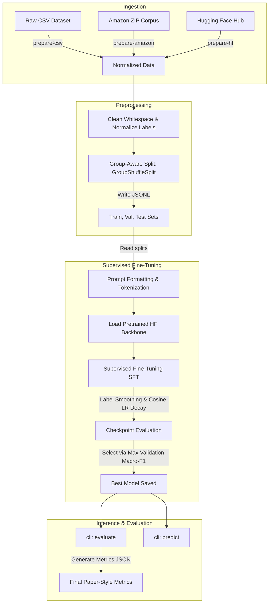

# Sarcasm Detection Judge Fine-Tuning

This documentation provides an in-depth, step-by-step breakdown of the sarcasm detection system, explaining the underlying machine learning concepts, the engineering architecture, codebase structure, and instructions for operation.

---

## 📖 Table of Contents

1. [Core Concepts & Theoretical Framework](#1-core-concepts--theoretical-framework)
   - [LLM-as-a-Judge Paradigm](#llm-as-a-judge-paradigm)
   - [Sequence Classification Fine-Tuning](#sequence-classification-fine-tuning)
   - [Label Smoothing Regularization](#label-smoothing-regularization)
   - [Cosine Learning Rate Decay with Warmup](#cosine-learning-rate-decay-with-warmup)
   - [Group-Aware Splitting & Data Leakage Prevention](#group-aware-splitting--data-leakage-prevention)
   - [Robust Class Imbalance Metrics](#robust-class-imbalance-metrics)
2. [System Architecture & Dataflow](#2-system-architecture--dataflow)
   - [High-Level Pipeline Diagram](#high-level-pipeline-diagram)
   - [Directory Layout](#directory-layout)
3. [Module-by-Module Code Walkthrough](#3-module-by-module-code-walkthrough)
   - [`config.py`](#configpy)
   - [`templates.py`](#templatespy)
   - [`splits.py`](#splitspy)
   - [`data.py`](#datapy)
   - [`modeling.py`](#modelingpy)
   - [`metrics.py`](#metricspy)
   - [`inference.py`](#inferencepy)
   - [`train.py`](#trainpy)
   - [`cli.py`](#clipy)
4. [Testing Suite Breakdown](#4-testing-suite-breakdown)
5. [Operational Playbook & CLI Usage](#5-operational-playbook--cli-usage)

---

## 1. Core Concepts & Theoretical Framework

The project is an implementation of the methodology from the paper **"LLM-as-a-judge for sarcasm detection using supervised fine-tuning."** It addresses the problem of sarcasm detection (classifying text as sarcastic `1` or non-sarcastic `0`) using a supervised fine-tuning pipeline built around Hugging Face transformer backbones.

### LLM-as-a-Judge Paradigm

Traditionally, sequence classification is handled by feed-forward networks on top of encoder representations (like BERT). Under the _LLM-as-a-judge_ paradigm:

- The input is framed in a prompt template instructing the model to evaluate the text as an evaluator or judge.
- Instead of relying on raw prompts with zero-shot LLMs (which are expensive and sensitive to prompt formatting), the model is fine-tuned _specifically_ on these prompt formats.
- The input sequence is wrapped in a prompt template (e.g., `Review: {text}\n\nJudge whether the review is sarcastic.`) so that the model learns the classification task in context.

### Sequence Classification Fine-Tuning

The project fine-tunes models such as **DistilBERT** (`distilbert-base-uncased-finetuned-sst-2-english`) and **RoBERTa**.

- During fine-tuning, the hidden state of the special classification token (e.g. `[CLS]` for BERT or `<s>` for RoBERTa) from the final encoder layer is passed to a classification head.
- The classification head is a linear layer mapping the hidden size (typically 768 dimensions) to the number of classes (2: sarcastic vs. non-sarcastic).
- The cross-entropy loss is computed against the correct label, and backpropagation updates all model weights (both the backbone and the classification head).

### Label Smoothing Regularization

In hard label training, the target vector for a class $y \in \{0, 1\}$ is a one-hot vector (e.g., $[1, 0]$ or $[0, 1]$). Standard cross-entropy loss encourages the model to output infinite logit differences to reach a probability of exactly $1.0$ for the correct class, leading to:

1. Overconfidence in predictions.
2. Overfitting to noisy or mislabeled training points.

**Label smoothing** modifies the target labels. Given a smoothing factor $\alpha$ (configured as `0.1` in this project) and $K$ classes (where $K=2$):
$$\tilde{y}_i = y_i (1 - \alpha) + \frac{\alpha}{K}$$
For a target label of `1` (sarcastic), the smoothed target vector becomes:
$$\tilde{y} = [0.05, 0.95]$$
Instead of driving probabilities to $1.0$ and $0.0$, the model is regularized to output moderate confidence levels. This prevents overfitting, increases generalization capability, and improves the calibration of output probabilities.

### Cosine Learning Rate Decay with Warmup

Fine-tuning pre-trained transformer backbones requires highly stable optimization to preserve pre-trained features while adapting to the target task. This project implements a **Cosine Learning Rate Decay with Warmup**:

1. **Warmup Phase:** The learning rate starts at zero and increases linearly over a fraction of total training steps (specified by `warmup_ratio=0.06`). This prevents gradient explosion or drastic weight updates during the first few iterations when the classification head is randomly initialized.
2. **Cosine Decay Phase:** After the warmup peak, the learning rate decreases following a cosine curve towards a small minimum value (often zero) over the remaining steps. This gradual decay allows the model to settle into sharp minima towards the end of the training process, enhancing convergence.

### Group-Aware Splitting & Data Leakage Prevention

In sarcasm datasets (especially review or headline datasets), multiple records can be closely related. For example, in product reviews, there might be multiple sentences/reviews written by the same author, or multiple reviews evaluating the exact same product.

- **The Risk:** If a standard random train/test split is performed, reviews of the same product or by the same author can appear in both the training set and the validation/test sets. This results in **data leakage**, inflating the model's test performance because it has already seen content from the same group during training.
- **The Solution:** The project implements group-aware splitting using scikit-learn's `GroupShuffleSplit`. Data is divided such that all records sharing a specific `group_id` (e.g., product identifier or source index) are assigned exclusively to a single split (either train, validation, or test). No group spans multiple splits.

### Robust Class Imbalance Metrics

Sarcasm detection datasets are frequently imbalanced, containing far more regular (non-sarcastic) examples than sarcastic ones. Accuracy alone is an unreliable indicator of performance. The project tracks:

- **Precision (per class):** $\frac{\text{True Positives}}{\text{True Positives} + \text{False Positives}}$ (minimizing false alarms).
- **Recall (per class):** $\frac{\text{True Positives}}{\text{True Positives} + \text{False Negatives}}$ (ensuring high coverage).
- **F1-Score (per class):** Harmonic mean of Precision and Recall.
- **Macro-F1:** The unweighted mean of class F1-scores. This is the primary metric for model checkpoint selection because it treats both classes with equal importance, regardless of how few sarcastic examples exist.
- **Confusion Matrix:** The raw counts of TN, FP, FN, TP to understand the specific error patterns (e.g., misclassifying sarcasm as non-sarcastic).

---

## 2. System Architecture & Dataflow

### High-Level Pipeline Diagram

The system operates as a unified workflow starting from data ingestion up to local deployment:



### Directory Layout

```text
sarcasm-detection/
│
├── configs/                   # YAML files configuring data, model, and training hyperparameters
│   ├── amazon_distilbert.yaml
│   ├── amazon_roberta.yaml
│   ├── reviews_distilbert.yaml
│   └── reviews_roberta.yaml
│
├── data/                      # Dataset directories
│   ├── raw/                   # Raw input files (e.g. CSVs, Amazon zip archives)
│   └── processed/             # Cleaned split JSONL outputs (train, validation, test)
│
├── runs/                      # Directory holding checkpoints, logs, and evaluation reports
│   └── <run-name>/
│       ├── best/              # Best checkpoint selected by validation Macro-F1
│       ├── test_metrics.json  # Saved metrics on the test split
│       └── checkpoint-XXXX/   # Epoch checkpoints
│
├── src/sarcasm_judge/         # Core Python package source code
│   ├── __init__.py
│   ├── __main__.py
│   ├── cli.py                 # Exposes subcommands
│   ├── config.py              # YAML config parsing
│   ├── data.py                # Data loading and format normalization
│   ├── inference.py           # Evaluation inference and probability prediction
│   ├── metrics.py             # Math metrics (Precision, Recall, F1, Confusion Matrix)
│   ├── modeling.py            # Sequence classification model/tokenizer loading
│   ├── splits.py              # GroupShuffleSplit orchestration
│   └── templates.py           # Judge prompt formatting
│
├── tests/                     # Unit and integration test suite
│   ├── test_data.py
│   ├── test_metrics.py
│   └── test_train.py
│
├── requirements.txt           # Package dependencies
├── pyproject.toml             # Configuration for build tools and entry points
└── README.md                  # Quick start instructions
```

---

## 3. Module-by-Module Code Walkthrough

### `config.py`

- **File Reference:** [config.py](src/sarcasm_judge/config.py)
- **Purpose:** Provides helper utility to parse YAML config files securely.
- **Key functions:**
  - `load_config(path: Path) -> dict`: Reads the configuration path, executes `yaml.safe_load`, and verifies that the configuration structure compiles into a dictionary.

### `templates.py`

- **File Reference:** [templates.py](src/sarcasm_judge/templates.py)
- **Purpose:** Handles the prompt template mapping to contextualize sequence inputs.
- **Key variables and functions:**
  - `DEFAULT_PROMPT_TEMPLATE`: Default text placeholder (`"{text}"`).
  - `format_judge_text(text: str, template: str | None) -> str`: Interpolates the text into the designated prompt template (e.g. `Review: {text} ...`). Validates that the `{text}` token exists inside the custom string template.

### `splits.py`

- **File Reference:** [splits.py](src/sarcasm_judge/splits.py)
- **Purpose:** Partitioning dataset records into train (70%), validation (15%), and test (15%) splits while preserving group allocations.
- **Key logic:**
  - Evaluates the number of unique values in the `group_column`. If there are less than 3 groups, it falls back to standard stratified splits using `train_test_split` (since grouping would be invalid).
  - If valid groups exist, it instantiates a `GroupShuffleSplit` with `train_size=0.70` to split off the training set.
  - It splits the remaining $30\%$ of the data by applying a second `GroupShuffleSplit` with a validation fraction of $\frac{0.15}{1.0 - 0.70} = 0.50$ (so validation and test splits get $15\%$ of the initial dataset each).

### `data.py`

- **File Reference:** [data.py](src/sarcasm_judge/data.py)
- **Purpose:** Raw data extraction, normalization, and partition writing.
- **Key components:**
  - `LABEL_MAP`: Maps text labels like `"ironic"`, `"sarcastic"`, `"regular"`, `"false"` to integers `0` or `1`.
  - `normalize_label(value)`: Normalizes boolean, numeric, or string-based target inputs to standard `0` or `1`.
  - `normalize_text(value)`: Trims whitespace and merges multiple concurrent spaces to clean inputs.
  - `prepare_csv_dataset`: Processes local CSV files. If a group column isn't provided, unique pseudo-group identifiers (`csv-<index>`) are generated.
  - `prepare_hf_dataset`: Dynamically imports Hugging Face's `datasets` library, pulls a remote repository (e.g., news headlines), and standardizes the columns into the pipeline format.
  - `prepare_amazon_corpus`: Extracts and reads raw files inside the Amazon Sarcasm Review Corpus.
  - `_iter_amazon_rows`: Recursively crawls directory paths to discover text, csv, or jsonl records. Resolves labels based on directory names (matching `"ironic"`/`"regular"` folders) and extracts the product group identifier from filename stems to preserve review pairings.

### `modeling.py`

- **File Reference:** [modeling.py](src/sarcasm_judge/modeling.py)
- **Purpose:** Model instantiation interface.
- **Key functions:**
  - `load_tokenizer_and_model`: Pulls tokenizers and classification models from Hugging Face Hub (or local output paths). Automatically assigns index maps (`id2label` and `label2id`) to ensure labels resolve to `"non_sarcastic"` or `"sarcastic"`. It forces `use_fast=True` to speed up tokenization.

### `metrics.py`

- **File Reference:** [metrics.py](src/sarcasm_judge/metrics.py)
- **Purpose:** Math evaluation using `scikit-learn` metrics.
- **Key functions:**
  - `compute_classification_metrics(labels, predictions)`: Computes Accuracy, F1-Score, Precision, Recall (both weighted/macro and per-class targets), along with the final confusion matrix representation.
  - `trainer_metrics(eval_prediction)`: Adapts prediction metrics to the formatting expected by the Hugging Face `Trainer` API (extracting logits, taking an argmax over the last dimension to get target classes, and computing validation scores).

### `inference.py`

- **File Reference:** [inference.py](src/sarcasm_judge/inference.py)
- **Purpose:** Prediction logic on arbitrary input text strings.
- **Key functions:**
  - `predict_texts(model_path, texts, threshold, max_length, prompt_template)`: Formats and tokenizes custom inputs. Passes inputs through the fine-tuned model on an available GPU/CPU. Extracts raw logits, applies a Softmax activation, and outputs the probability of class `1` (sarcastic). If the probability is equal to or greater than the configurable `threshold` (default `0.5`), it labels the prediction as `"sarcastic"`.

### `train.py`

- **File Reference:** [train.py](src/sarcasm_judge/train.py)
- **Purpose:** Supervised fine-tuning pipeline orchestration.
- **Key components:**
  - Integrates Dataset loading using pandas JSONL loaders.
  - Uses Hugging Face `Dataset.map` to tokenize texts in parallel batches.
  - Truncates token arrays to a maximum sequence length of `192` to maintain the setup defined in the reference literature.
  - Configures `TrainingArguments` with parameters including learning rate, epochs, weight decay, warmup ratio, evaluation strategies, label smoothing factor (`0.1`), and sets the checkpoint selection target to validation `macro_f1`.
  - **Dynamic Compatibility Layer:** Detects the active version of Hugging Face `transformers` using Python's `inspect` package to check the `Trainer` class signature. It assigns the fast tokenizer either to the newer `processing_class` parameter or to the legacy `tokenizer` parameter automatically, ensuring robust environment execution.
  - Saves the best model checkpoint to the `best` subdirectory, saves the matching tokenizer, evaluates the model on the test split, and writes a metrics JSON file.
  - `evaluate_model`: Loads a saved checkpoint and evaluates it on a targeted dataset split (e.g. validation or test) using raw PyTorch `DataLoader` and `DataCollatorWithPadding` to obtain classification reports.

### `cli.py`

- **File Reference:** [cli.py](src/sarcasm_judge/cli.py)
- **Purpose:** Main entrypoint. It wraps all submodules inside an `argparse` structure, exposing subcommands like `prepare-csv`, `prepare-amazon`, `prepare-hf`, `train`, `evaluate`, and `predict`.

---

## 4. Testing Suite Breakdown

The repository contains automated unit tests under the `tests/` directory to ensure system stability:

1. **`test_data.py`**
   - Verifies that label mapping and alias resolution (e.g., matching `"ironic"` to `1` and `"regular"` to `0`) works correctly.
   - Asserts that `prepare_csv_dataset` successfully splits data and outputs `train.jsonl`, `validation.jsonl`, `test.jsonl`, and `metadata.json`.
   - Confirms prompt formatting constraints.
2. **`test_metrics.py`**
   - Ensures metric wrappers correctly calculate F1 indicators and accurately compile a 2x2 integer confusion matrix.
3. **`test_train.py`**
   - Instantiates the Hugging Face `TrainingArguments` from mock config dictionary values to verify configuration parsing is correct.
   - Validates the dynamic `Trainer` signature check by creating a dummy model, verifying that it correctly maps tokenizers to either `processing_class` or `tokenizer` depending on the `transformers` library version.

---

## 5. Operational Playbook & CLI Usage

### Setup & Installation

```bash
python -m venv .venv
.venv/Scripts/Activate.ps1
pip install -r requirements.txt
pip install -e .
```

### 1. Data Ingestion & Preprocessing

To clean and split a generic CSV dataset:

```bash
python -m sarcasm_judge prepare-csv data/raw/reviews.csv data/processed/reviews --text-column text --label-column label --group-column group_id
```

To ingest the Amazon Sarcasm Review Corpus:

```bash
python -m sarcasm_judge prepare-amazon data/raw/amazon data/processed/amazon
```

### 2. Fine-Tuning the Judge

Specify the model parameters in a YAML config file (e.g. `configs/amazon_distilbert.yaml`) and run:

```bash
python -m sarcasm_judge train --config configs/amazon_distilbert.yaml
```

### 3. Model Evaluation

To calculate performance metrics (accuracy, precision, recall, f1-score, and confusion matrix) on a test/validation split:

```bash
python -m sarcasm_judge evaluate --model-path runs/amazon-distilbert/best --dataset-dir data/processed/amazon --split test
```

### 4. Interactive Sarcasm Detection Inference

To run predictions on custom texts:

```bash
python -m sarcasm_judge predict --model-path runs/amazon-distilbert/best --text "Great, another update that broke everything." --text "Fast shipping and excellent battery life."
```

_Output JSON format:_

```json
[
  {
    "text": "Great, another update that broke everything.",
    "sarcasm_probability": 0.7575,
    "label": "sarcastic"
  },
  {
    "text": "Fast shipping and excellent battery life.",
    "sarcasm_probability": 0.0543,
    "label": "non_sarcastic"
  }
]
```
