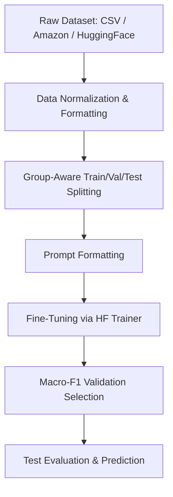

# Project Summary: Sarcasm Detection Judge Fine-Tuning

This project implements a binary sarcasm judge using supervised fine-tuning (SFT) on Hugging Face sequence-classification models (such as RoBERTa or DeBERTa) based on the methodology from the paper **"LLM-as-a-judge for sarcasm detection using supervised fine-tuning."**

---

## 🎯 Project Core Objective

The goal is to build an automated **binary sarcasm detector** (judge) that classifies text instances as:

- **`0`**: Non-sarcastic
- **`1`**: Sarcastic

Rather than training a classifier from scratch or relying on prompting zero-shot LLMs, this project leverages a sequence classification model configured with a specific prompt template and fine-tuned on labeled dataset splits using supervised learning.

---

## 🏗️ Architecture & Component Design

The project is structured as a modular Python package containing:

### 1. Project Configuration & Metadata

- [pyproject.toml](pyproject.toml): Configures build tools and registers the command-line interface entry point `sarcasm_judge = sarcasm_judge.cli:main`.
- [requirements.txt](requirements.txt): Lists library dependencies (`torch`, `transformers`, `datasets`, `scikit-learn`, `pandas`, `pytest`, etc.).

### 2. Command Line Interface (CLI)

- [cli.py](src/sarcasm_judge/cli.py): Exposes subcommands to orchestrate the entire flow:
  - `prepare-csv`: Normalizes and splits general CSV datasets.
  - `prepare-amazon`: Processes the Amazon Sarcasm Review Corpus.
  - `prepare-hf`: Normalizes and splits Hugging Face Hub datasets (e.g., news headlines).
  - `train`: Starts supervised fine-tuning using a YAML configuration.
  - `evaluate`: Computes metrics on a fine-tuned model for a given test/validation split.
  - `predict`: Predicts labels and calculates confidence levels for specific texts.

### 3. Data Ingestion & Preprocessing

- [data.py](src/sarcasm_judge/data.py): Handles loading datasets, standardizing text inputs by stripping multiple spaces, mapping aliases (such as `ironic`, `sarcastic` to `1` and `regular`, `non-sarcastic` to `0`), and organizing data into metadata objects.
- [splits.py](src/sarcasm_judge/splits.py): Implements **group-aware dataset splitting**. To prevent data leakage (e.g., reviews corresponding to the same product leaking across train/validation/test sets), it groups records by `group_id` using scikit-learn's `GroupShuffleSplit`.
- [templates.py](src/sarcasm_judge/templates.py): Formats raw text according to a customizable prompt layout, instructing the model to act as a judge.

### 4. Training, Modeling, & Inference

- [modeling.py](src/sarcasm_judge/modeling.py): Loads the pretrained model and fast tokenizer from Hugging Face (`AutoTokenizer` and `AutoModelForSequenceClassification`).
- [train.py](src/sarcasm_judge/train.py): Implements the training loop via Hugging Face's `Trainer`. Highlights:
  - Label smoothing (0.1) for regularization.
  - Learning rate decay with a cosine scheduler and warm-up steps.
  - Model selection based on validation Macro-F1.
  - Dynamic adaptation to the Hugging Face `Trainer` version (`processing_class` vs. `tokenizer` argument support).
- [inference.py](src/sarcasm_judge/inference.py): Performs class probability extraction (using softmax on logits) and makes predictions using a configurable threshold (default `0.5`).

### 5. Metrics & Evaluation

- [metrics.py](src/sarcasm_judge/metrics.py): Computes precision, recall, and F1-score for both classes individually, along with macro/weighted averages, accuracy, and a confusion matrix.

---

## 🔄 Methodology Steps: How Results Are Reached



### Step 1: Data Normalization

- Cleans whitespace and translates variable labels (like `"non-sarcastic"`, `"ironic"`, `true`, `false`) into standard binary `0` and `1` targets.

### Step 2: Leakage-Free Splitting

- Uses a group column (e.g. `group_id`) to split the data into **Train (70%)**, **Validation (15%)**, and **Test (15%)** sets. Splitting guarantees that text sequences referring to the same item are kept together in a single split, ensuring metrics reflect generalization performance.

### Step 3: Prompt Formatting & Tokenization

- Formats text fields using templates, e.g.:

  ```text
  Review:
  {text}

  Judge whether the review is sarcastic.
  ```

- Tokenizes inputs using a specified model token limit (192 by default) matching paper specifications.

### Step 4: Supervised Fine-Tuning (SFT)

- Trains the backbone classifier (e.g., `roberta-base`) using:
  - **Label Smoothing:** Smooths hard target distributions to reduce model overconfidence.
  - **Cosine LR Decay:** Slowly reduces the learning rate over epochs.
  - **Weight Decay:** Penalizes large model weights to mitigate overfitting.

### Step 5: Model Selection & Saving

- Validates the model at each epoch. The checkpoint with the highest **validation Macro-F1** is selected and saved to the `runs` directory.

### Step 6: Test Set Evaluation & Deployment

- The CLI runs predictions over the `test` split to report final paper-style evaluation metrics (Precision, Recall, F1, Accuracy, and Confusion Matrix), saving them in JSON reports.
