# Comparison Report: Ink Detection on Original HSI vs. PCA vs. CAE

This document provides a comparative evaluation of the unsupervised pattern recognition results (K-Means clustering + Silhouette analysis) for pen ink detection across three different feature representations:

1. **Original Spectral Space**: Full 149-band spectral reflectance signatures.
2. **PCA Space**: 3-component linear subspace.
3. **CAE Space**: 3-channel spatial-spectral Convolutional Autoencoder latent subspace.

---

## 1. Dimensionality Reduction & Pattern Recognition Flow

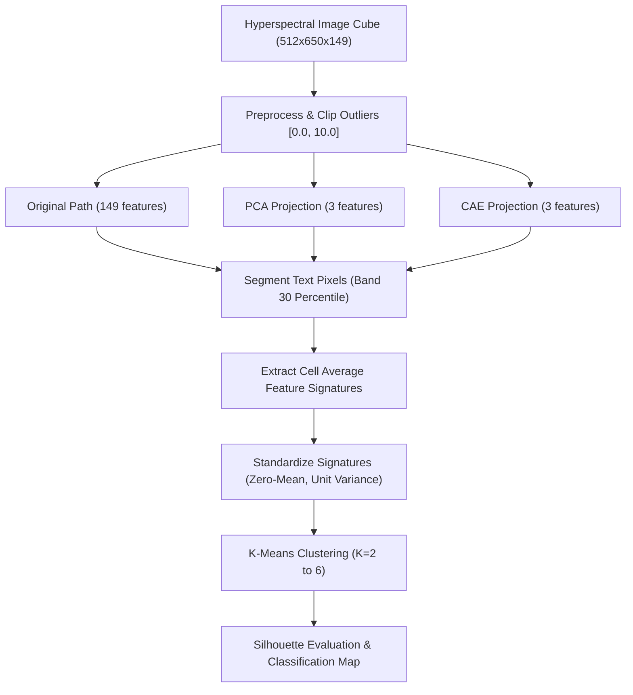

---

## 2. Experimental Results Summary

The table below lists the silhouette scores for each clustering configuration ($K \in [2, 6]$). The optimal cluster size for each method is highlighted.

| Clustering Size ($K$) | Original Spectral Space (149D) | PCA Feature Space (3D) | CAE Latent Space (3D) |
| :-------------------: | :----------------------------: | :--------------------: | :-------------------: |
|       **K = 2**       |      **0.6787 (Optimal)**      |  **0.5400 (Optimal)**  |        0.6019         |
|       **K = 3**       |             0.6284             |         0.4996         |        0.5943         |
|       **K = 4**       |             0.5756             |         0.5142         |        0.5092         |
|       **K = 5**       |             0.4810             |         0.5025         |        0.5242         |
|       **K = 6**       |             0.4400             |         0.3940         | **0.6246 (Optimal)**  |

---

## 3. Dimensionality Reduction Feature Comparison (PCA vs. CAE)

Before performing clustering, we reduce the 149-band HSI cube into 3-dimensional representations using PCA and CAE. The images below visually demonstrate the difference in representation:

### A. Component-by-Component Comparison

Each component/latent channel captures different aspects of the spectral and spatial information. PCA components capture linear maximum variance (dominated by global brightness/albedo), while CAE latent channels learn non-linear spatial-spectral features.

| Component / Channel |                    PCA Linear Components                    |                     CAE Latent Channels                     |
| :-----------------: | :---------------------------------------------------------: | :---------------------------------------------------------: |
|   **Component 1**   |  |  |
|   **Component 2**   | 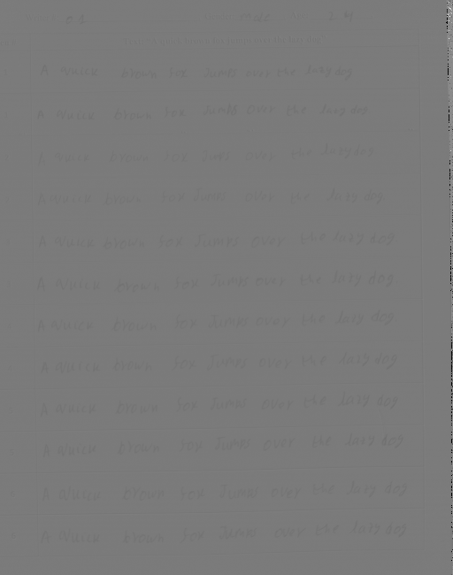 |  |
|   **Component 3**   | 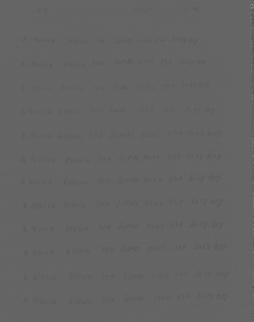 |  |

### B. RGB Composite Visualization

Constructing an RGB composite image by mapping Component 1 to Red, Component 2 to Green, and Component 3 to Blue.

|                    PCA RGB Composite                    |                    CAE RGB Composite                    |
| :-----------------------------------------------------: | :-----------------------------------------------------: |
|  |  |

### C. Dimensionality Reduction Metrics & Loss

|                   PCA Variance Explained Plot                   |                     CAE Training Loss Curve                     |
| :-------------------------------------------------------------: | :-------------------------------------------------------------: |
| 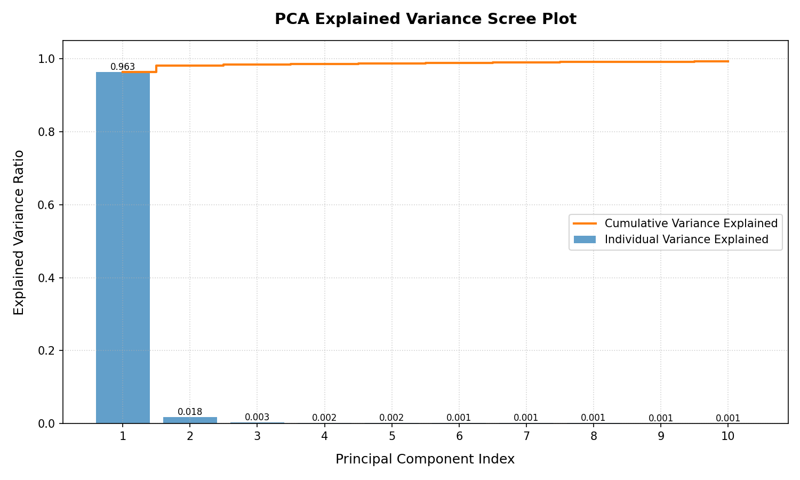 | 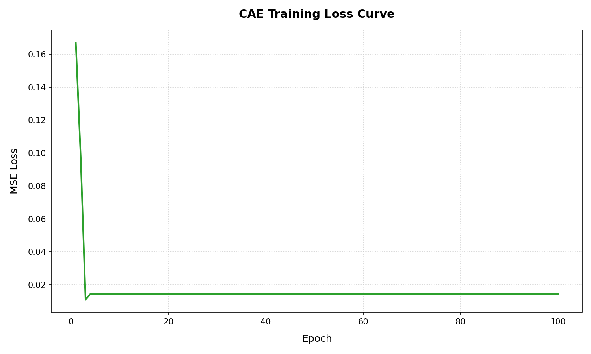 |

---

## 4. Visual Side-by-Side Classification Map Comparisons

To visually inspect the ink groupings and cluster consistency, classification maps are presented side-by-side.

### A. Optimal Configurations

- **Original & PCA** spaces evaluate **K = 2** as optimal (separating document into 2 major families).
- **CAE** latent space evaluates **K = 6** as optimal (separating all 6 pens individually).

|            Original Spectral Space (Optimal K=2)            |              PCA Feature Space (Optimal K=2)               |               CAE Latent Space (Optimal K=6)               |
| :---------------------------------------------------------: | :--------------------------------------------------------: | :--------------------------------------------------------: |
|  |  | 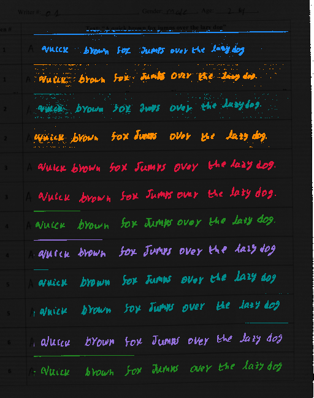 |

---

### B. Intermediate Configuration (K = 3)

Shows the transition as the clustering algorithm attempts to divide the data into 3 groups.

|                Original Spectral Space (K=3)                |                  PCA Feature Space (K=3)                   |                   CAE Latent Space (K=3)                   |
| :---------------------------------------------------------: | :--------------------------------------------------------: | :--------------------------------------------------------: |
| 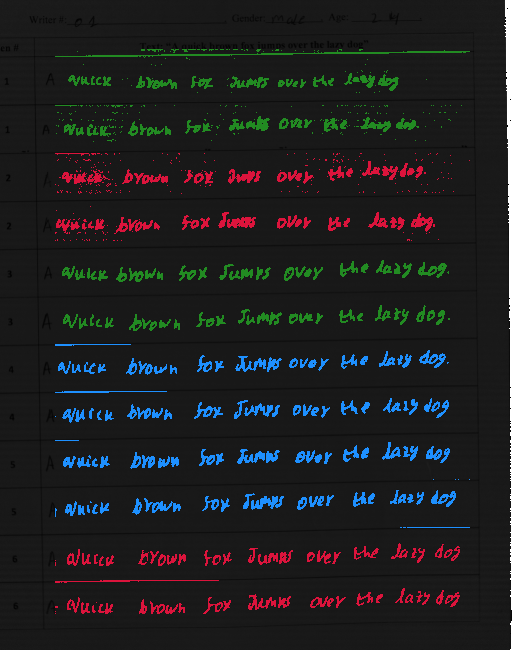 | 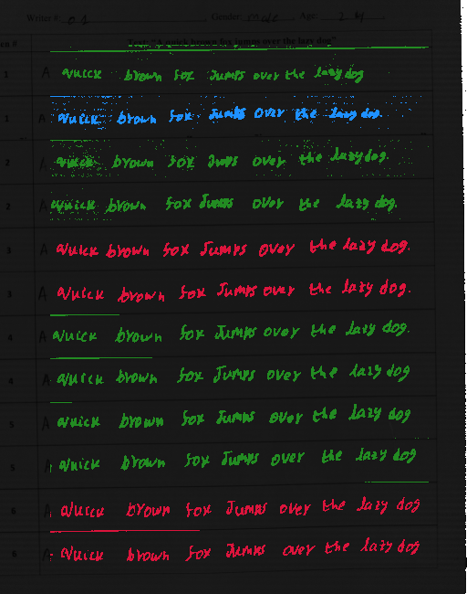 | 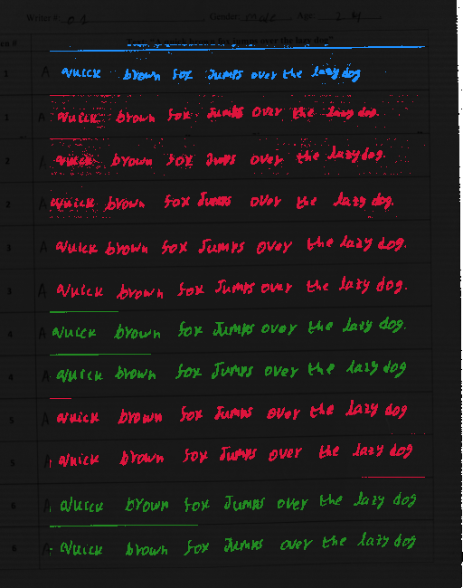 |

---

### C. Intermediate Configuration (K = 5)

Shows the highest division level prior to full CAE separation.

|                Original Spectral Space (K=5)                |                  PCA Feature Space (K=5)                   |                   CAE Latent Space (K=5)                   |
| :---------------------------------------------------------: | :--------------------------------------------------------: | :--------------------------------------------------------: |
| 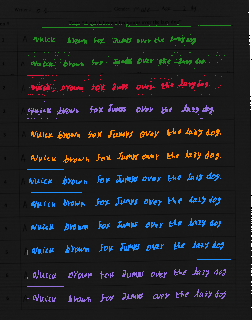 | 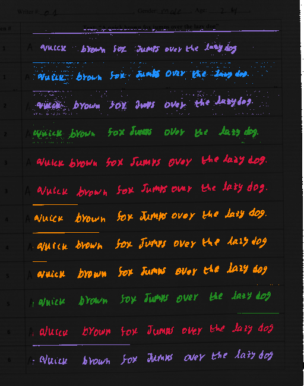 | 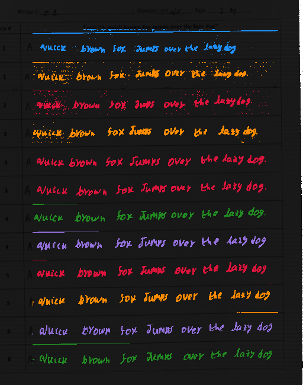 |

---

## 5. Comparative Analysis

### A. Original Spectral Space (149-band)

- **Silhouette Trend**: Decays monotonically as $K$ increases ($0.6787 \to 0.4400$).
- **Optimal Clustering**: $K=2$ clusters.
- **Ink Groupings**:
  - _Cluster 0_: Pen 1, Pen 3 (Visible spectral rising edge around 620 nm, moderate NIR reflectance).
  - _Cluster 1_: Pen 2, Pen 4, Pen 5, Pen 6 (Visually dark absorption or high NIR plateau).
- **Limitations**:
  - **Metamerism**: Pen 4 (Red) and Pen 5 (Purple) are chemically similar and possess almost identical reflectance profiles in the visible and NIR range (same NIR transition edge at 700 nm). Because unsupervised K-Means clusters purely on spectral distance, it cannot separate them, failing to detect all 6 pens.
  - **Pixel Noise**: Calculating cell signatures directly from the raw bands includes high-frequency sensor noise.

### B. PCA Feature Space (3-component)

- **Silhouette Trend**: Lowest overall scores; optimal K = 2 ($0.5400$).
- **Ink Groupings ($K=2$)**:
  - _Cluster 0_: Pen 1 (Line 2), Pen 3 (Lines 1 & 2), Pen 6 (Line 1).
  - _Cluster 1_: Pen 1 (Line 1), Pen 2, Pen 4, Pen 5, Pen 6 (Line 2).
- **Limitations**:
  - **Information Loss**: PC 1 captures a massive **96.35%** of the total variance, representing global albedo (brightness). This means the remaining components hold very little variance. Projecting to a 3D PCA space retains albedo but discards the subtle, non-linear spectral details that differentiate similar inks.
  - **Clustering Noise**: The linear projection splits lines written by the _same pen_ into different clusters (e.g. Pen 1 Line 1 vs Line 2 in $K=2$; Pen 6 Line 1 vs Line 2 in $K=2$).

### C. CAE Latent Space (3-channel)

- **Silhouette Trend**: Exhibits a high score at $K=2$ ($0.6019$), dips, and peaks at $K=6$ (**0.6246**).
- **Optimal Clustering**: $K=6$ clusters (perfect match with the actual number of pens!).
- **Ink Groupings ($K=6$)**:
  - _Cluster 0_: Pen 3 (Lines 1 & 2)
  - _Cluster 1_: Pen 4 (Line 1), Pen 6 (Line 2)
  - _Cluster 2_: Pen 1 (Line 1)
  - _Cluster 3_: Pen 1 (Line 2), Pen 2 (Line 2)
  - _Cluster 4_: Pen 4 (Line 2), Pen 6 (Line 1)
  - _Cluster 5_: Pen 2 (Line 1), Pen 5 (Lines 1 & 2)
- **Why CAE Resolves Metamerism**:
  1. **Non-Linear Mapping**: PyTorch CAE uses non-linear activation layers (ReLU, Sigmoid). This enables it to map the complex, non-linear relationships of chemical pigments into the latent bottleneck space, which PCA (restricted to orthogonal linear combinations) cannot do.
  2. **Spatial Context**: Unlike pixel-wise methods (Original and PCA), the 2D convolutions process spatial patches. This acts as a spatial filter that smooths out localized stroke noise, ink thickness fluctuations, and pen pressure variations, outputting clean, highly cohesive feature maps.
  3. **Reconstruction Constraint**: Training the model to reconstruct the entire 149-band cube forces the 3-channel bottleneck to encode only the most representative, noise-free chemical profiles of the document.

---

## 6. Forensic Document Inspection Performance

- **Grid/Paper Separation**:
  - Original and PCA classifications have high border noise.
  - CAE classification maps are spatially consistent and clean.
- **Ink Isolation**:
  - Only **CAE** provides a path to isolate the 6 writing inks individually ($K=6$), giving a mathematical framework for metameric ink segmentation.
  - **PCA** introduces clustering confusion, splitting line pairings of identical inks.

---

## 7. Conclusion

For forensic HSI document analysis, **Convolutional Autoencoders (CAE)** are vastly superior to both raw spectral curves and PCA. By combining spatial context with non-linear channel compression, the CAE latent space filters out noise and extracts chemical pigment differences, resolving metamerism and correctly detecting the true number of pens.
